# UST Material - EC2 Deployment Projects

This repository contains multiple applications that were deployed on AWS EC2 instances over the past week. Each project demonstrates different architectural patterns and technologies including Application Load Balancers, Elastic IPs, NAT Gateways, VPCs, and RDS.

## � Repository Stats


| 📊 Metric | 🔢 Count |
|-----------|---------|
| **Total Projects** | 5 |
| **AWS Services Used** | 10+ |
| **Programming Languages** | 3 (Java, Python, JavaScript) |
| **Databases Deployed** | 6 |
| **EC2 Instances** | 15+ |
| **Load Balancers** | 6 |

## �📊 Architecture Landscape


##  Projects Overview

### 1. Three-Tier Web Architecture
A production-grade three-tier architecture demonstrating complete AWS deployment:
- **Web Tier** - React.js frontend with Nginx web server
- **Application Tier** - Node.js/Express API backend
- **Database Tier** - Aurora MySQL Multi-AZ RDS

Features external and internal Application Load Balancers, Auto Scaling Groups, and Multi-AZ deployment for high availability.

```mermaid
flowchart LR
    subgraph Internet
        User[👤 User]
    end
    
    subgraph "AWS VPC"
        subgraph "Public Subnet - AZ1"
            ELB1[External ALB]
            Web1[Nginx Web Server]
        end
        
        subgraph "Public Subnet - AZ2"
            Web2[Nginx Web Server]
        end
        
        subgraph "Private Subnet - AZ1"
            IELB1[Internal ALB]
            App1[Node.js API]
        end
        
        subgraph "Private Subnet - AZ2"
            App2[Node.js API]
        end
        
        subgraph "Database Subnet"
            RDS1[(Aurora MySQL Primary)]
            RDS2[(Aurora MySQL Replica)]
        end
    end
    
    User --> ELB1
    ELB1 --> Web1
    ELB1 --> Web2
    Web1 --> IELB1
    Web2 --> IELB1
    IELB1 --> App1
    IELB1 --> App2
    App1 --> RDS1
    App2 --> RDS1
    RDS1 -.Replication.-> RDS2
    
    style User fill:#4285f4
    style ELB1 fill:#ff9900
    style IELB1 fill:#ff9900
    style RDS1 fill:#527fff
    style RDS2 fill:#527fff
```



### 2. Microservices Architecture
Two Spring Boot microservices demonstrating service-to-service communication:
- **Orders Service** - Manages order operations (Port 8081)
- **Users Service** - Manages user operations (Port 8082)

Both services were deployed on separate EC2 instances in different target groups and connected to an internal Application Load Balancer. The internal ALB routes traffic from an Apache2-hosted frontend deployed on another instance, which is also connected to an external Application Load Balancer.

```mermaid
flowchart TB
    subgraph Internet
        Client[👤 Client]
    end
    
    subgraph "Public Subnet"
        ExtALB[External ALB<br/>Port 80/443]
        Apache[Apache2 Frontend<br/>EC2 Instance]
    end
    
    subgraph "Private Subnet"
        IntALB[Internal ALB<br/>Port 8081/8082]
        
        subgraph "Target Group 1"
            Orders[Orders Service<br/>EC2 - Port 8081]
            OrdersDB[(ordersdb)]
        end
        
        subgraph "Target Group 2"
            Users[Users Service<br/>EC2 - Port 8082]
            UsersDB[(usersdb)]
        end
    end
    
    Client -->|HTTPS| ExtALB
    ExtALB --> Apache
    Apache -->|API Calls| IntALB
    IntALB -->|Route /orders| Orders
    IntALB -->|Route /users| Users
    Orders -.->|REST API| Users
    Orders --> OrdersDB
    Users --> UsersDB
    
    style Client fill:#4285f4
    style ExtALB fill:#ff9900
    style IntALB fill:#ff9900
    style Orders fill:#6db33f
    style Users fill:#6db33f
    style Apache fill:#d55
```



### 3. Monolithic Application (Spring Boot)
A traditional monolithic Spring Boot application showcasing a single-service architecture with MySQL database integration. The application was later migrated to use AWS RDS to demonstrate managed database concepts and high availability.

```mermaid
flowchart LR
    User[👤 User] -->|HTTP| EC2[Spring Boot App<br/>EC2 Instance<br/>Port 8080]
    EC2 --> RDS[(AWS RDS MySQL<br/>Multi-AZ)]
    RDS -.Automated Backups.-> S3[S3 Backup]
    
    style User fill:#4285f4
    style EC2 fill:#6db33f
    style RDS fill:#527fff
    style S3 fill:#569a31
```



### 4. User-BlogPost FastAPI Application
A FastAPI-based blog management system with bidirectional relationships between users and posts using SQLAlchemy ORM. Hosted on Apache2 using reverse proxy configuration for production deployment.

```mermaid
flowchart LR
    User[👤 User] -->|HTTP| Apache[Apache2<br/>Reverse Proxy<br/>Port 80]
    Apache -->|Forward to| FastAPI[FastAPI App<br/>uvicorn<br/>Port 8000]
    FastAPI --> ORM[SQLAlchemy ORM]
    ORM --> DB[(MySQL Database)]
    
    FastAPI -.CRUD Operations.-> Models[User & BlogPost Models]
    
    style User fill:#4285f4
    style Apache fill:#d55
    style FastAPI fill:#009688
    style DB fill:#00758f
```



## 🔄 AWS Deployment Workflow


### 5. UST Hacksession Week 1
Collection of hackathon projects and experimental code from the first week's session.

##  Technologies Used


### Technology Comparison Across Projects

| Feature | 3-Tier Architecture | Microservices | Monolithic | FastAPI |
|---------|-------------------|---------------|------------|---------|
| **Frontend** | React + Nginx | Apache2 | N/A | Apache2 |
| **Backend** | Node.js/Express | Spring Boot (2 services) | Spring Boot | FastAPI |
| **Database** | Aurora MySQL Multi-AZ | MySQL (2 DBs) | AWS RDS MySQL | MySQL |
| **Load Balancer** | External + Internal ALB | External + Internal ALB | Single EC2 | Reverse Proxy |
| **Scalability** | ⭐⭐⭐⭐⭐ | ⭐⭐⭐⭐⭐ | ⭐⭐⭐ | ⭐⭐⭐ |
| **Complexity** | High | High | Low | Medium |
| **High Availability** | Multi-AZ | Multi-Instance | Single Instance | Single Instance | 

##  Documentation

Each project directory contains its own README with specific setup instructions, API documentation, and deployment details.

##  Quick Start

Navigate to each project directory for detailed setup and running instructions:

```bash
# For Three-Tier Architecture
cd 3-Tier-Architecture/app-tier
npm install
node index.js

# For Spring Boot Microservices
cd Microservices/orders-code
./mvnw spring-boot:run

# For FastAPI Application
cd User-BlogPost-FastAPI-Bidirectional-Application
pip install -r requirements.txt
uvicorn main:app --reload
```

##  AWS Architecture Highlights


**Key Features:**
- **Multi-AZ Deployment**: High availability across multiple Availability Zones
- **Load Balancing**: External and internal Application Load Balancers for traffic distribution
- **Auto Scaling**: Dynamic scaling based on demand
- **VPC Configuration**: Custom VPC with public and private subnets
- **NAT Gateway**: Secure internet access for private subnet resources
- **RDS Integration**: Managed database services with Multi-AZ failover support

##  Notes

All projects were tested and deployed on AWS EC2 instances with production-grade configurations. Ensure you have the proper database configurations, environment variables, and AWS credentials set before running locally or deploying to AWS.
